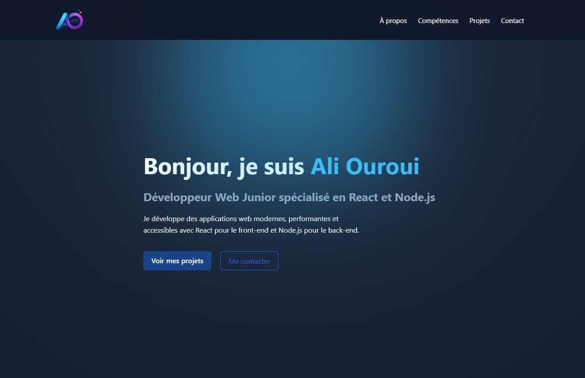

# Portfolio Développeur Web – Ali Ouroui

## 📌 Présentation

Ce projet est mon **portfolio de développeur web**, conçu pour présenter mes compétences, mes projets et permettre aux recruteurs ou collaborateurs de me contacter facilement.

Le site met en avant plusieurs projets réalisés dans le cadre de ma formation et de mes projets personnels, en donnant un aperçu clair de mes compétences.

---

## 🚀 Démo

🔗 Portfolio en ligne : *https://ali-ouroui-portfolio.netlify.app/*

## 🛠️ Stack technique

- **React**
- **Vite**
- **CSS**
- **Framer Motion** – animations
- **React Router** – gestion des routes
- **EmailJS** – formulaire de contact

---

## ✨ Fonctionnalités

- Navigation fluide entre les sections
- Animations au scroll
- Cartes projets interactives
- Pages dédiées pour chaque projet
- Formulaire de contact fonctionnel
- Design responsive (mobile, tablette, desktop)
- Barre de progression de scroll
- Bouton retour en haut de page

---

## 📁 Projets présentés

### Kasa

Application React de location immobilière.

Compétences développées :

- création de composants réutilisables
- gestion des routes avec React Router
- structuration d'une application React

Stack :

- React
- Sass

---

### Mon Vieux Grimoire

API backend permettant de gérer une bibliothèque de livres avec authentification.

Compétences développées :

- création d'API REST
- authentification avec JWT
- gestion d'une base de données

Stack :

- Node.js
- Express
- MongoDB

---

## 📧 Formulaire de contact

Le formulaire utilise **EmailJS** pour envoyer les messages directement par email sans nécessiter de backend.

Fonctionnalités :

- validation des champs
- message de confirmation
- protection anti-spam (honeypot)

---

## 📱 Responsive Design

Le site est entièrement responsive et optimisé pour :

- mobile
- tablette
- desktop

---

## 📈 Améliorations futures

- ajout de nouveaux projets
- amélioration des animations
- optimisation du SEO
- ajout d’un blog technique

---

## 👨‍💻 Auteur

**Ali Ouroui**

- LinkedIn : https://www.linkedin.com/in/ali-ouroui-75752a3b6/
- Email : [ali.ouroui@outlook.fr](mailto:ali.ouroui@outlook.fr)
